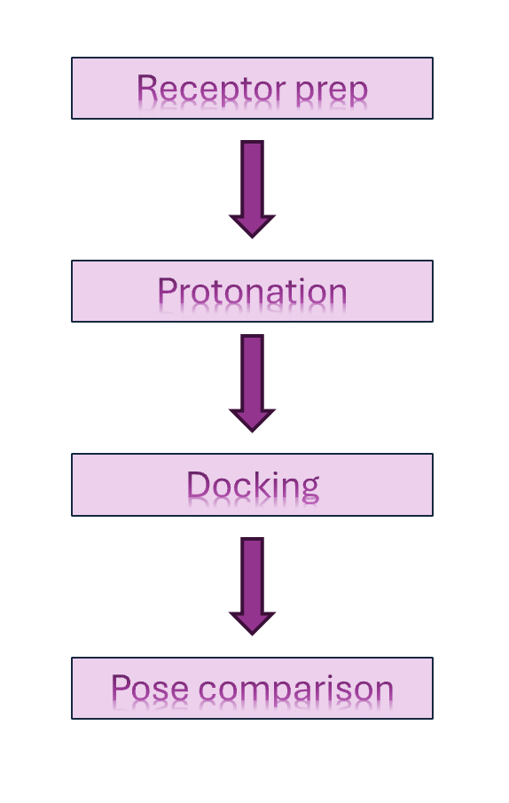
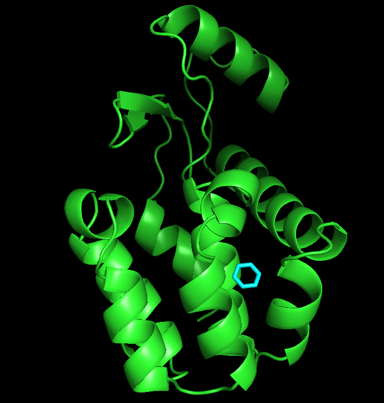
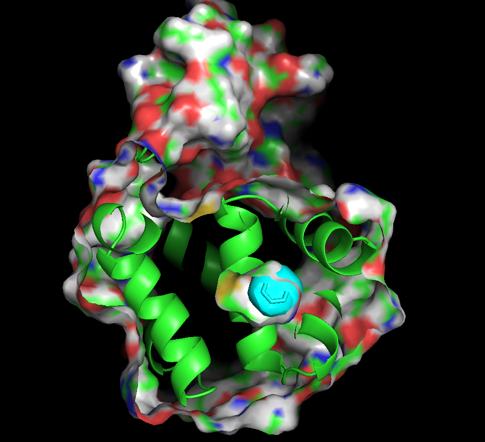
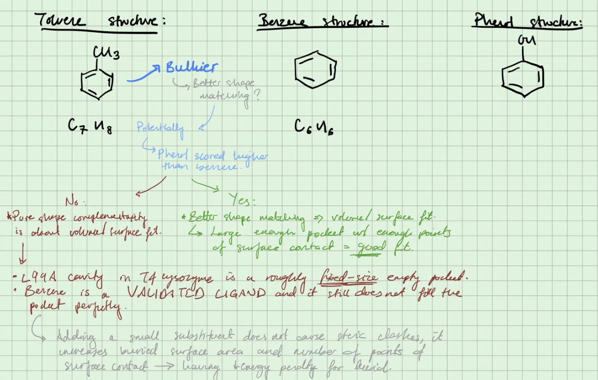

::: {style="position: relative;"}

:::: {.pixel-bar-frame style="--bar-v:url('/images/border_pink_vertical.png'); --bar-h:url('/images/border_pink_horizontal.png');"}

## What I worked on today

   I ran my first validated docking experiment:

   **"Docking benzene into the hydrophobic cavity of T4 lysozyme L99A (PDB 181L) using AutoDock Vina"**

 I picked this system because the crystal structure already has benzene 
    bound, so I could check my pipeline against a known answer to check if
    my docking was a success.

::::

{.sparkle-corner style="top: -15px; right: -15px; animation-delay: 0.6s"}
{.sparkle-corner style="bottom: 45px; right: 0px; animation-delay: 0.3"}
{.sparkle-corner style="top: 150px; left: -15px; animation-delay: 0.5s"}

:::

::::: {style="position: relative;"}

## Pipeline: 

{.sparkle-corner style="top: -15px; left: -50px; animation-delay: 0.7s"}

:::::

### Overview:

    
- Prepared the receptor with `mk_prepare_receptor.py` (Meeko)
- Ran pH 7.4 protonation through PDB2PQR/PROPKA
- Converted the ligand with OpenBabel
- Docked with Vina
- Loaded the output back into PyMOL and overlaid it against the original crystal pose.

:::::: {style="position: relative;"}

## Docked Images

{.sparkle-corner style="top: -15px; left: -50px;animation-delay: 0.8s"}

::::::

::::::: {style="position: relative;"}

## What I learned
{.sparkle-corner style="top: -15px; left: -50px; animation-delay: 0.5s"}

:::::::

The top-scoring pose lined up closely with the crystallographic 
    benzene confirmation the pipeline (receptor prep → protonation → docking → pose comparison) actually works end to end, not just that 
    the software ran without errors. This matters because every later 
    result is only as trustworthy as this baseline check.

:::::::: {style="position: relative;"} 

## A brief results table
{.sparkle-corner style="top: -15px; left: -50px; animation-delay: 0.2s"}

::::::::

| Ligand        | Affinity (kcal/mol) | Annotation                                                                 |
|---------------|----------------------|------------------------------------------------------------------------------|
| Toluene       | -6.252               | Near-optimal cavity fit: extra methyl adds hydrophobic surface contact   |
| Phenol        | -5.653               | Hydroxyl buried in hydrophobic pocket with no apparent desolvation penalty. This is likely a blind spot of Vina's scoring function. |
| Benzene       | -5.456               | Validated against crystal pose: smaller than cavity, leaves space unfilled |
| Hexylbenzene  | -4.877               | Too large for cavity: incomplete burial / steric strain                  |
| Ethanol       | -2.674               | Small and pola: poor hydrophobic packing, weakest binder in the panel   |

 
::::::::: {style="position: relative"}

# *Unexpected results*
{.sparkle-corner style="top: -15px; left: -50px; animation-delay: 0.3s"}

:::::::::

During my follow-up screening panel (benzene, toluene, hexylbenzene, 
phenol, ethanol against the same hydrophobic pocket), phenol's docking score 
didn't make sense. Its affinity was more than expected. Phenol has a hydroxyl group, so my 
first assumption was that its score must be coming from a hydrogen 
bond with a polar residue in the pocket. I thought that would be the obvious story 
for a molecule with an -OH group.

Vina's score didn't show a desolvation penalty for phenol's buried hydroxyl group either, which is a known blind spot of simple empirical scoring functions. Automatically, I thought this is not necessarily a real thermodynamic fact about the system itself.

Instead of assuming, I wanted to actually check it so I measured the 
actual distances between phenol's hydroxyl and nearby residues in 
PyMOL. Hydrogen bonds have a fairly strict cutoff roughly 
3.5 Å between H-bond donors and acceptors. Nothing in the pocket was 
within that range. So the H-bond explanation didn't make sense once I 
actually measured it.

What was really driving the score turned out to be the same thing 
as benzene and toluene, which was hydrophobic packing against the cavity walls. 
The -OH group was just there, it was not doing the work I'd 
assumed.

## *Toluene*

Toluene scoring higher than benzene was surprising. I then took a moment to think about it, here are my messy notes:

::: {.callout-note collapse="true" title="Handwritten notes: shape-matching reasoning"}

:::

# **Takeaway:** 

A plausible-sounding mechanism isn't necessarily a
confirmed one. measuring the actual geometry caught an assumption 
I would have otherwise written down as fact.

# **Pipeline access:**

Looking to access the pipeline I used? Check out this post:

[Access to pipeline](/posts/2026-06-20-second-post/index.qmd){.btn .btn-outline-dark}

---

See my [About page](/about.qmd) for more on my background.
